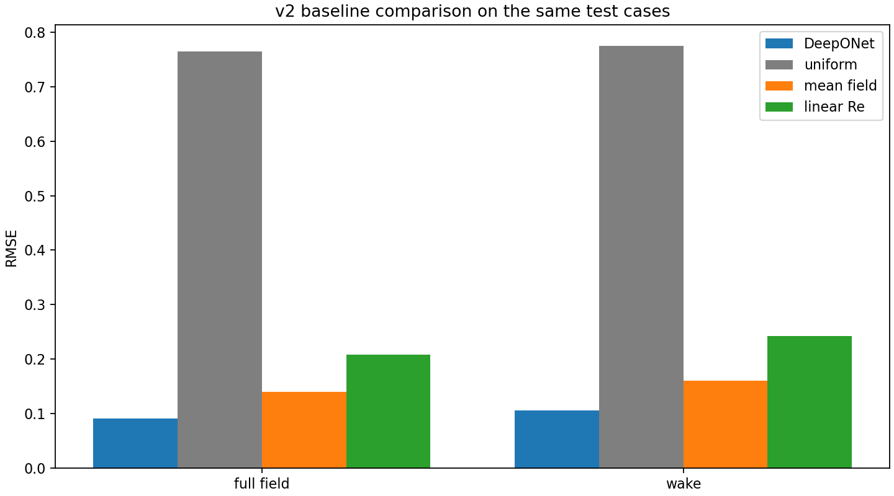

# DeepONet CFD Surrogate

DeepONet CFD Surrogate is a scientific-machine-learning project for learning
2D cylinder-flow velocity fields from public CFD data. It combines
DeepONet/operator learning with a reproducible CPU runtime and portability
checks across amd64, ARM64, and Ascend environments.

The current release is a **2D, velocity-only (`u,v`) CFD benchmark**. It is a
validated operator-learning prototype, not a production monopile solver,
pressure-capable model, or state-of-the-art claim.

The engineering workflow covers:

- PyTorch and DeepONet operator learning;
- strict whole-case splits and train-only normalization;
- Docker, Docker Compose, bind mounts, and an optional multi-stage build;
- Docker Buildx images for `linux/amd64` and `linux/arm64`;
- native Kunpeng ARM64 execution through Donau;
- Ascend 910B compatibility through `torch_npu` and CANN;
- cross-backend numerical checks and workload–hardware matching.

## Validation snapshot

The main experiment uses 32 independent `CFDBench/cylinder/bc` cases with a
22/5/5 whole-case train/validation/test split. The branch input is
`[Re, U_inlet, time_norm]`, the trunk input is `[x/D, y/D]`, and the target is
the nondimensional velocity field `[u/U, v/U]`. Pressure is not present in the
selected public release.

The best configuration is selected by full-field RMSE on the fixed test set:

| Experiment | Query grid | Trainable parameters | Test full RMSE | Wake RMSE |
|---|---:|---:|---:|---:|
| Baseline | 24×16 | 47,330 | 0.095425 | 0.111985 |
| Larger MLP | 24×16 | 181,602 | 0.091521 | 0.107904 |
| Fourier coordinates | 24×16 | 184,162 | 0.091458 | 0.107728 |
| Best configuration | 48×32 | 184,162 | **0.091270** | **0.106116** |

On the same five-case test set, the best configuration compares as follows:

| Method | Full RMSE | Wake RMSE |
|---|---:|---:|
| DeepONet | **0.091270** | **0.106116** |
| Training mean-field | 0.140311 | 0.160382 |
| Linear-Re/time interpolation | 0.207626 | 0.242343 |
| Uniform-inlet field | 0.765044 | 0.775069 |

The model also outperforms the linear-Re/time baseline on the interpolation
subset (`0.096940` vs `0.118531`). These results establish a reproducible
public-data pipeline and useful baseline comparisons; they do not establish a
production surrogate for monopile design.



See the full compact report in
[`docs/PRETRAINING_REPORT.md`](docs/PRETRAINING_REPORT.md).

## Portability evidence

| Target | Runtime | Result |
|---|---|---|
| Windows / amd64 | Docker CPU | Real HDF5 one-epoch smoke passed |
| Kunpeng / ARM64 | Native user-space Python + Donau | One-epoch smoke passed; test-field RMSE matched the Windows smoke |
| Ascend 910B / ARM64 | PyTorch + `torch_npu` + CANN + Donau | Single-NPU one-epoch smoke passed; field RMSE relative difference `2.47e-5` |

For the small 47,330-parameter smoke configuration, the measured runtime was
about 7.53 s/epoch on Kunpeng CPU and 250.08 s/epoch on one Ascend 910B. This
is a workload-specific compatibility and hardware-fit observation, not a
general NPU performance claim. The tested Huawei nodes did not provide a
user-accessible Docker daemon, so the reproducible target path was native
ARM64 Python plus the platform PyTorch/Ascend stack.

Details are in [`docs/PORTABILITY_REPORT.md`](docs/PORTABILITY_REPORT.md).

## Quick start

The source data and generated artifacts are intentionally not stored in this
repository. Download the selected public members and prepare the HDF5 dataset
with the scripts under `src/`, then run the validation entry points from a
Python 3.11 environment with the dependencies in `requirements.txt`.

For a local CPU container:

```powershell
docker build -t deeponet-cfd-surrogate:cpu .
docker run --rm deeponet-cfd-surrogate:cpu
docker compose run --rm deeponet
```

For a real HDF5 one-epoch smoke after the dataset is prepared:

```powershell
docker run --rm `
  --mount "type=bind,source=$((Get-Location).Path)\processed_v2,target=/workspace/deeponet-cfd-surrogate/processed_v2,readonly" `
  deeponet-cfd-surrogate:cpu `
  python src/train_v2.py --config configs/v2_e1.yaml --epochs 1 --run-name docker_smoke
```

The default `Dockerfile` is the verified CPU build path. The separate
`Dockerfile.multistage` demonstrates builder/runtime separation with
`COPY --from`; it is provided as an engineering reference rather than a
claim of a particular image-size reduction.

To publish a multi-platform image from a logged-in registry account:

```powershell
docker buildx build `
  --platform linux/amd64,linux/arm64 `
  --push `
  --tag <registry-user>/deeponet-cfd-surrogate:latest .

docker buildx imagetools inspect <registry-user>/deeponet-cfd-surrogate:latest
```

The same tag resolves to the amd64 image on an amd64 host and the arm64 image
on an ARM64 host. Emulation is useful for compatibility checks, but native
ARM64 builds are normally faster.

## Repository layout

```text
.
├── README.md
├── LICENSE
├── Dockerfile
├── Dockerfile.multistage
├── compose.yaml
├── requirements*.txt
├── src/
├── configs/
├── donau/
├── docs/
│   ├── ARCHITECTURE.md
│   ├── CONTAINERIZATION.md
│   ├── DATASET_AND_LICENSE.md
│   ├── PORTABILITY_REPORT.md
│   ├── PRETRAINING_REPORT.md
│   └── TRANSFER_LEARNING.md
├── metadata/
└── results/
    └── figures/
```

The code filenames retain a few internal `v2` suffixes so existing configs
and scripts remain reproducible; the public project name is simply
**DeepONet CFD Surrogate**.

## Scope and limitations

- The selected CFDBench release contains interpolated `u` and `v` fields only;
  no pressure head is trained.
- The dataset is a 2D cylinder benchmark, not monopile CFD or an OpenFOAM
  production dataset.
- The transfer interface supports a future `[u,v,w,p]` schema, but unseen `w`
  and `p` channels require validated OpenFOAM/monopile fine-tuning data.
- Ascend validation is a single-NPU compatibility smoke. It is not distributed
  training or an acceleration result.

## Data, code, and citation

The repository code is released under the MIT License. The CFDBench data is
not redistributed here; consult its dataset card for the data terms and cite
the upstream work:

> Luo, Yining, Yingfa Chen, and Zhang. *CFDBench: A Comprehensive CFD
> Benchmark for Deep Learning.* arXiv:2310.05963, 2023.

See [`docs/DATASET_AND_LICENSE.md`](docs/DATASET_AND_LICENSE.md) for source
links, provenance, and the separation between code and dataset terms.

## Current focus

The next scientific step is to test whether public flow/operator pretraining
reduces the number of validated OpenFOAM monopile cases needed for a useful
velocity/pressure surrogate. That experiment is intentionally separate from
the present public cylinder benchmark.
